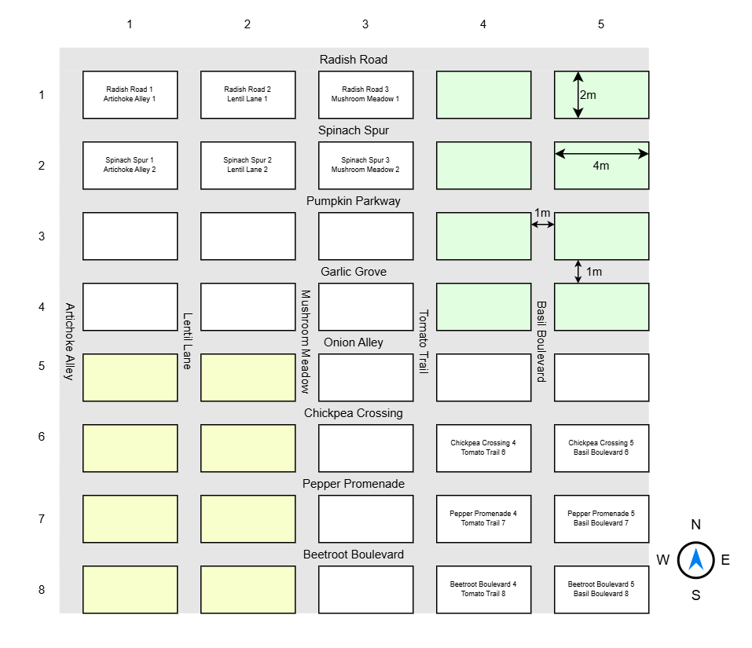

# Garden Manager


## Introduction

You are part of a community managing allotment gardens on a piece of farmland. The following diagram shows the layout of the gardens:

As you can **see** in the image below, the gardens are arranged in a grid. The paths between the gardens are named after yummy vegetables. Here are the names of the paths as JavaScript arrays (from north to south and from west to east):

```javascript
const horizontalPaths = [
    "Radish Road", "Spinach Spur", "Pumpkin Parkway", "Garlic Grove", 
    "Onion Alley", "Chickpea Crossing", "Pepper Promenade", 
    "Beetroot Boulevard", 
];
const verticalPaths = [
    "Artichoke Alley", "Lentil Lane", "Mushroom Meadow", 
    "Tomato Trail", "Basil Boulevard", 
];
```



Over time, a way of identifying gardens has established itself. Each garden is identified by the name of the nothern or western path followed by the number of the garden from the west or north. Examples:

* _Radish Road 1_ would be the garden in the north-west corner as _Radish Road_ is the northernmost path and _1_ is the westernmost garden.
* _Artichoke Alley 1_ would be an alternative name for _Radish Road 1_ as _Artichoke Alley_ is the westernmost path and _1_ is the northernmost garden.
* _Beetrood Boulevard 5_ would be the garden in the south-east corner as _Beetroot Boulevard_ is the southernmost path and _5_ is the easternmost garden.
* _Basil Boulevard 8_ would be an alternative name for _Beetroot Boulevard 5_ as _Basil Boulevard_ is the easternmost path and _8_ is the southernmost garden.

The garden layout image above contains some examplary garden names to illustrate the naming scheme.

History has shown that the gardens have different levels of fertility. The fertility of a garden is measured in _fertility points_ (FP). The white gardens have 1 FP, the light green gardens have 1.5 FP, the light yellow gardens have 0.5 FP. The monthly fee for a garden is calculated using the following formula:

_fee in € = m² of the garden * FP * 3€_

The path names, number of gardens per column/row, and the FP values are fixed and do not change. It is ok if the software must be changed if the garden layout, names, or FP values change.

## Operations

Your job is to implement an API for managing the gardens. The API must support the following operations:

1. Domain *Garden Assignment Management*:
    * Assign a garden to a member:
        * For the member, store name and email address (both strings, mandatory). You do *not* need to check the validity of the email address.
        * The garden is identified by its name (see naming scheme above, string, mandatory). The name must be validated to be a valid garden name. Optional requirement: **Note that each garden can be identified in two different ways** (see examples above).
        * The API must return a proper status code if the garden is already assigned to another member.
        * Internally, the system must store the timestamp of the assignment.
    * Unassign a garden:
        * Garden identification works like in the assignment operation.
        * The API must return a proper status code if the garden is not assigned to a member.
    * Get assignment of a garden:
        * Garden identification works like in the assignment operation.
        * The API must return the name and email address of the member assigned to the garden and the timestamp of the assignment.
    * Member notification (optional requirement):
        * Sometimes, carrot-devouring monster rabbits are seen in a garden. In this case, the surrounding members of the rabbit-infested garden must be notified.
        * Garden identification works like in the assignment operation.
        * The API returns an array of email addresses of the surrounding gardens (north, north-east, east, south-east, south, south-west, west, north-west) of the infested garden.
2. Domain *Accounting*:
    * Get fertility points for a garden:
        * Garden identification works like in the assignment operation.
        * The API must return the fertility points of the garden.
    * Get monthly fee:
        * No input parameters.
        * Returns a list of all members (name and email address) and their monthly fee.
        * Optional requirement: If a single member (same name and email address) has multiple gardens, the fee is the sum of the fees of the individual gardens.

## Tasks

* Design the API based on the requirements above. Choose fitting DTOs, HTTP methods, paths, and status codes.
* Store the garden data in one or more JSON files. You can decide if you create a single file, one file per member, or one file per garden.
* Implement the API using ASP.NET Core Minimal API.
* Document assumptions and design decisions in the code.

## Grading

* In order to pass the assignment, you must fulfill the following requirements:
    * Everything must compile without errors.
    * All API endpoints must be present. HTTP methods and paths must match the requirements.
    * Garden identification in two ways (see example above) is **not** required to pass the exam. A single way of identifying a garden (e.g. path name for horizontal and garden number for vertical) is sufficient.
    * Minor logic and/or validation errors are tolerated.
    * Requirements marked as optional are not required to pass the exam.
* The grade is based on the following criteria:
    * Correctness of the implementation.
    * Code quality (e.g., readability, maintainability, separation of concerns, efficiency).
    * Compliance with the requirements.
    * Meaningful design of the HTTP API.
    * Proper error handling and DTO validation.
